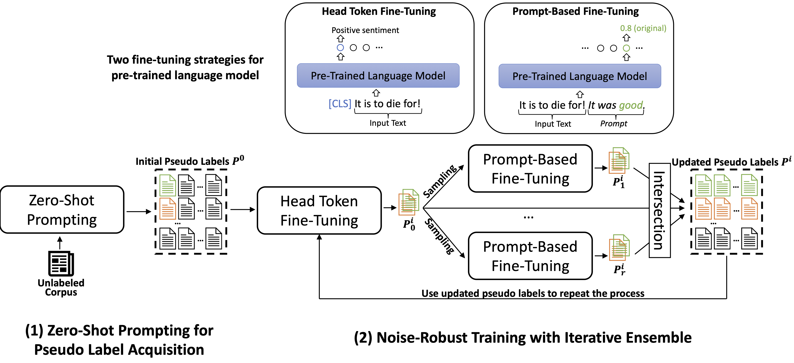

# PIEClass
The source code used for paper [PIEClass: Weakly-Supervised Text Classification with Prompting and Noise-Robust Iterative Ensemble Training](https://arxiv.org/abs/2305.13723), published in EMNLP 2023.

## Overview
**PIEClass** is a weakly-supervised text classifier with prompting and iterative ensemble training. Unlike previous methods, PIEClass utilizes PLM prompting to go beyond keyword-level pseudo labeling and iterative fine-tuning prompt-based and head-token-based classifiers to expand pseudo labels while largely ensure their quality. For more details, please check our paper: [https://arxiv.org/abs/2305.13723](https://arxiv.org/abs/2305.13723). 

</img>

## Requirements
GPU is required for running PIEClass.

### Dependency
We develop the code with Python 3.8. Before running, you need to first install the required packages (within a virtual environment is recommended):
```
pip3 install -r requirements.txt
```

## Reproduce Results
We use seven benchmmark datasets: AGNews, 20News, NYT-Topics, and Yelp can be found at [here](https://github.com/ZihanWangKi/XClass); IMDB and Amazon can be found at [here](https://github.com/yumeng5/LOTClass); we include the NYT-Fine corpus in the ```./datasets/NYT-Fine/``` folder.

We provide the scripts to reproduce our results on the benchmark datasets in ```./scripts/```. You can run them in the root directory by:
```
./scripts/AGNews.sh
```

## Citations

If you find our work useful for your research, please cite the following paper:
```
@inproceedings{zhang2023pieclass,
    title={{PIEC}lass: Weakly-Supervised Text Classification with Prompting and Noise-Robust Iterative Ensemble Training}, 
    author={Yunyi Zhang and Minhao Jiang and Yu Meng and Yu Zhang and Jiawei Han},
    year={2023},
    booktitle={EMNLP}
}
```